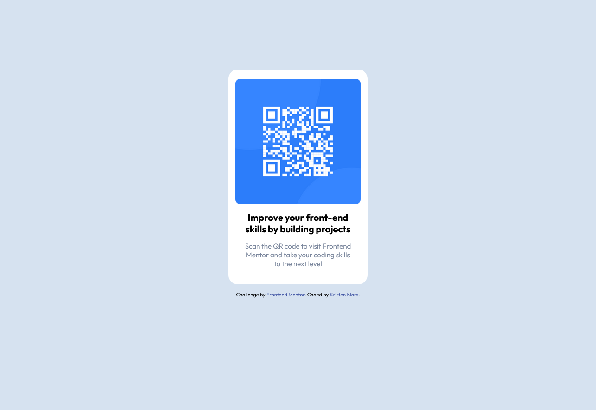

# Frontend Mentor - QR code component solution

This is a solution to the [QR code component challenge on Frontend Mentor](https://www.frontendmentor.io/challenges/qr-code-component-iux_sIO_H). Frontend Mentor challenges help you improve your coding skills by building realistic projects. 

## Table of contents

- [Overview](#overview)
  - [Screenshot](#screenshot)
  - [Links](#links)
- [My process](#my-process)
  - [Built with](#built-with)
  - [What I learned](#what-i-learned)
  - [Continued development](#continued-development)
  - [Useful resources](#useful-resources)
- [Author](#author)

## Overview

### Screenshot

### Links

- Solution URL: [Codepen](https://codepen.io/kristheprogrammer/pen/gOoNdGx?editors=1100)

## My process

### Built with

- Semantic HTML5 markup
- CSS custom properties

### What I learned

In this project, I learned to use CSS variables and allowed me to practice basic styling with CSS properties.

### Continued development

I would like to continue working on getting components responsive.

### Useful resources

- [Resource 1](https://www.w3schools.com/howto/howto_html_favicon.asp) - This helped me with inserting the favicon. It is a great resource.
- [Resource 2](https://www.w3schools.com/css/css3_variables.asp) - This reseource taught me how to use CSS variables.

## Author

- Website - [Kristen Moss](https://github.com/kristheprogrammer)
- Frontend Mentor - [@kristheprogrammer](https://www.frontendmentor.io/profile/kristheprogrammer)
